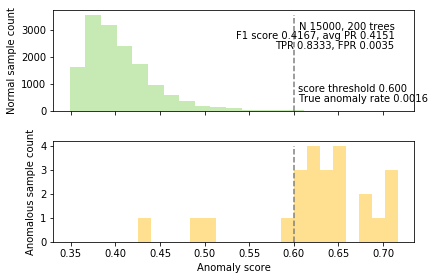

# Isolation Forest Implementation for anomaly detection

The goal of this project is to implement the original [Isolation Forest](paper_iforest.pdf) algorithm by Fei Tony Liu, Kai Ming Ting, and Zhi-Hua Zhou. Unlike other common anomaly detection technoques that model what normal looks like, this isolation forest algorithm is focusing on the anomalies which are few and different. 

## Overview

The Isolation Forest algorithm isolates observations by randomly selecting a feature and then randomly selecting a split value between the maximum and minimum values of the selected feature. The logic argument goes: isolating anomaly observations is easier because only a few conditions are needed to separate those cases from the normal observations. On the other hand, isolating normal observations require more conditions. Therefore, an anomaly score can be calculated as the number of conditions required to separate a given observation.

The way that the algorithm constructs the separation is by first creating isolation trees, or random decision trees. Then, the score is calculated as the path length to isolate the observation

The implementation is in [iforest.py](iforest.py), in this file, I defined following classes and methods:  

<table border="0">
<tr>
<td width="50%" valign="top"></td><td width="50%" valign="top"></td>
</tr>
<tr>
<td valign="top">

</td>

</tr>
</table>

## Result Interpretation

In [iforest_example.ipynb](iforest_example.ipynb), I visualized the reuslt by the distribution of data, we can see the results of the isolation forest. These data sets all have known targets indicating normal versus anomaly.
The metrics I used for this classfication here is TPR, FPR and confusion matrix. Besides, small subset was used for tree visulization to indicate the overall structure of indivual trees in the isolation forest.

